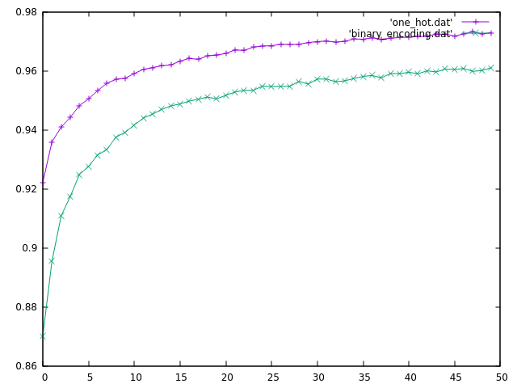

## BINARY-ENCODING vs ONE-HOT ENCODING

This experiment compares the results of using binary encoding in the output layer against the one-hot encoding that is used in most neural networks for classification tasks. The task at hand is MNIST digit classification. In the binary encoding case, we only have 4 neurons in the output layer and if the value of a neuron is greater than or equal to 0.5, it is considered as 1 (or fired), else it is considered as 0. This way we get a 4-bit pattern which can be mapped onto the 9 integers (from 0 to 9).

#### Why use binary encoding?
The only reason I can see to use binary encoding over one-hot encoding is efficiency. Usually, fully connected layers are the primary reason behind the inefficiency of Neural Networks as compared to, say, Convolution Layers. So, using log(n) neurons instead of n neurons in the output layer will definitely lead to some improvement in performance. Although this might not significantly increase your performance, if you're already using a deep network, it is interesting from a theoretical point-of-view nonetheless.

#### Does it work?

<!--  -->

As can be seen from the graph (which shows the accuracy vs epoch for the two models), not completely. The accuracy of the model using binary encoding is about 1.2% lesser than that of the model using one hot encoding. Although this might not seem like a huge difference, we must keep in mind, that classifying MNIST dataset is a relatively simple task and this degradation can be much more severe in more complicated tasks. 

#### Why though?
From a representation point-of-view, binary-encoding is as much complete as is one-hot encoding so naively, we should expect the two cases to have similar accuracies. Then why is this not the case? I can see two reasons for it.

1. Taking the value greater than 0.5 to be one and less than 0.5 to be 0 in binary encoding is less accurate in some sense than interpreting the values as probabilities (or more accurately, scores) in one-hot encoding and taking the one with highest value as the answer. The final prediction in the case of binary-encoding is more sensitive to the absolute values of the neurons in the output layer.

2. The second reason is more fundamental to how neural networks work. The firing of a neuron usually corresponds to some pattern in the input. So in the one-hot case, we can easily interpret the firing of an output neuron to correspond to the presence of the digit associated with it. However, it becomes difficult to interpret in the binary encoding. In this case, more than one neurons can fire for each input. So a neuron can be expected to fire for two (or more) inputs which do not necessarily have any such pattern in common. This method assumes inputs of two arbitrary classes to have some common patterns which is not necessarily the case. There can exist such mappings that can give better results than the other but finding such mapping is not trivial / intuitive, at least as far as I know.

#### Learning the mapping used
In *train_joined.py*, I have added an extra layer of 4 neurons after a layer of 10 neurons and separately
trained the outputs at both layers. After training, the layer with 4 neurons would learn the mapping
used in the dataset.

Point to ponder: Can we extend this framework to learn the optimal mapping?