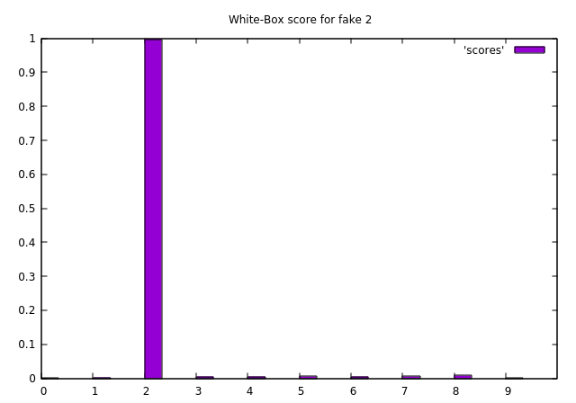
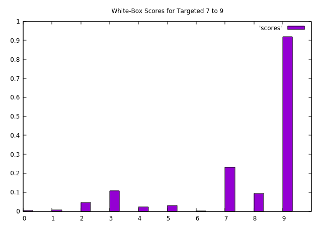

## ADVERSARIAL EXAMPLES

#### Aim
The aim of this experiment is to learn and see how to generate adversarial examples for a given neural network (white-box attacks) and see how the examples generated on one network work on other networks (black-box attacks). Specifically, following is the breakdown of the task:
- Generate examples that cause network to mis-classify
- Generate examples that cause network to mis-classify and also look like real images
- Try the above 2 cases on another network (black-box attack)

#### Neural Network Models
We will use two networks, one will be a fully connected network and
the other will be a convolutional network with a fully connected output layer.

The fully connected network has the following layers: 128, 64, 32, 10(output)

**Accuracy at last epoch: 96.6600%**

The convolutional network has the following layers: 16, 32, 64, 10(output, fc)

**Accuracy at last epoch: 99.0700%**

Also, it must be noted that the output is coming from a sigmoid layer (instead of a softmax layer), so the output is not to be interpreted as probability but simply as a score.

### Non-Targeted Generation

#### Output on the original Dataset

For the conv net, the average scores for each class on eval set are:

What we can see from above graphs is that the score for correct class is always 1.

#### Ouput on the generated images (White-Box)
Now the scores for the adversarial examples created by our network for the convnet (white-box)

	
	

	
	

	
	

	
	

	
	

	
	

	
	

	
	

	
	

	
	

As we can see above, we have created images which successfully fool the network. In fact, we see
that the scores of other (non intended) classes is even lower, on an average than it is for real
images. So, in a way, the network is even more confident about it's results on the adversarial images.

#### Ouput on the generated images (Black-Box)

We can see from the values (not shown here, check the results folder), the black box attack didn't quite
work as expected (or were the expectations wrong?). If the black box attack
would've been successful, the fc net would have also classified the images wrongly
with outputs same as the convnet. The fc net always seems to give the output 3
which is most likely due to high bias learned during training corresponding
to 3.
Note that this is not a failure. In fact much research has gone in to make
black-box attacks work and such simple method is not expected to work in the first place.

### Targeted Generation

The aim here is to create images that look like 7 but are classified incorrectly by the network
images for 0,3,4,5 were succesfully created with lambda = 10. 
For rest of the targets, I had to reduce the lambda as the image is still being classified as 7.
Here, lambda is the hyperparameter which controls how much the generated image looks like the desired image.
Also, please note that 7 is just an example and we can use any image corresponding to any number to run the attack.

#### Output on the original image

	
	

#### Output on the generated Images (White-Box)

Score on the image generated for all targets from above image:

	
	

	
	

	
	

	
	

	
	

	
	

	
	

	
	

	
	

	
	

As we can see that by making just very small changes to an image which was originally
classified as 7 with high probability, we can change the output classification.
Similarly, we can generate adversarial examples for other images as well.

#### References:
https://ml.berkeley.edu/blog/2018/01/10/adversarial-examples/

https://pytorch.org/tutorials/beginner/fgsm_tutorial.html

<!-- set style data histogram
set xtics (0,1,2,3,4,5,6,7,8,9)
set xrange [0:10]
set boxwidth 1
set style fill solid border -1
set title "Avg. scores for original 0"
plot 'scores'
 -->
